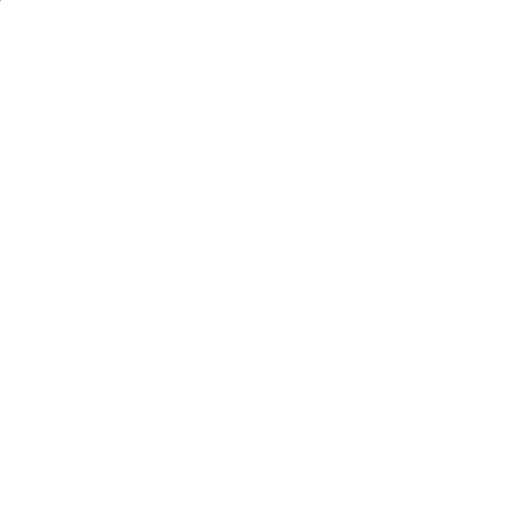

# Bio-Learning

  

  
**A fantastic repo revealing the essence of learning.**
  

## Overview

- #TODO: The authors are lazy, so presently there is no overview.

## What is bio-learning

- Using the theory of evolution to train creatures for certain target, and then transfer their experience to neural network.

## Author

- Author A
- Author B

## Tasks

### Task1: Trajectory Prediction of Flies in Laboratory

- Use laser guns to shoot flies, ones without capability of  predicting trajectory dies.
- Flies are equipped with motion sensors, their trajectory is fed into neural network of laser gun controller.
- This is a GAN method!

### Task2: Multi-Flies Tracking in Laboratory

- #TODO: The authors haven't learned how to write nonsense on MFT problems yet, so it is empty here.

## Roadmap

Since the author writing this part is sorrowful currently, the order doesn't matter.

- [x] One of the authors found that there are many flies in the laboratory. Then the authors discussed on it and agreed on that the flies are much more agile and clever than humans and machines. Therefore they decided to observe flies.
- [ ] Create a dataset of flies.
- [ ] Build models with respect to each tasks. Since the tasks are vague, the authors decide to use neural network.
- [ ] Read some papers on machine-learning, especially the method of training.
- [ ] Have some little grey cells for breakfast every day ;D

## Changelog

- Apr. 30, 2020: Nonsense v0.0.0 on bio-learning released. 
